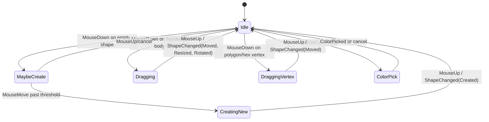

# Shape Editing Migration Notes

## Mouse Handler IO Map

| Handler/branch | Reads | Writes | Target |
| --- | --- | --- | --- |
| MouseDown guard | `IsWaitShowTool`, selected tool, run flag | none | Host/View guard plus `ShapeEditState.IndexTool`, `ShapeEditState.IsRun` |
| MouseDown color reset | `IsGetColor`, `_mouseDown` | `IsSetColor=false` | `ShapeEditState.IsGetColor`, `ShapeEditState.IsSetColor`; later `ColorPickerOverlay` |
| MouseDown scan select | `Mode=Scan`, `IndexRotChoose` | `IndexRotChoose`, redraw | `ShapeEditState.Mode`, repository-backed scan options, `IImageCanvas.RequestRedraw()` |
| MouseDown current shape | `rotCurrent`, `StatusDraw`, `_dragAnchor` | `Mode=Edit` when needed | `ShapeEditState.Current`, `ShapeEditState.Mode` |
| MouseDown maybe-create | current shape empty, shape type, screen point | `_maybeCreate`, `_creatingNew`, `_previewNew`, `_createStartImg` | `InteractionMode.MaybeCreate`, `IImageCanvas.ScreenToImage()` |
| MouseDown angle/center UI | current `_dragAnchor`, mouse screen point | show/hide adjustment controls | Host-owned UI; UC2 emits intent/event if retained |
| MouseDown polygon add/close | current polygon, local point, `ParaShow.RadEdit` | polygon points, close flag, dirty flag | `ShapeEditState.Current`, `ShapeEditOptions.ParaShow`, `GeometryHelper`, `ShapeChanged(PolygonClosed)` |
| MouseDown polygon vertex | polygon vertices, local point | active vertex, drag anchor, drag snapshot | `ShapeEditState.Current`, `InteractionMode.DraggingVertex` |
| MouseMove guard | selected tool, run flag | hide adjustment controls | `ShapeEditState.IndexTool`, `ShapeEditState.IsRun` |
| MouseMove threshold | `_mouseDown`, `pDown`, current point | `_drag=true` | `InteractionMode.MaybeCreate -> Dragging/CreatingNew` |
| MouseMove scan hit-test | `Mode=Scan`, current crop type, scan lists, `rotArea`, zoom/scroll | `IndexRotChoose` | `ShapeEditState.Mode`, `ShapeEditOptions`, `IShapeRepository`, `IImageCanvas` |
| MouseMove color picker | `IsGetColor` | cursor, pan/click zoom, background worker | `ColorPickerOverlay.Active`, `IImageCanvas.SetCursor()` |
| MouseMove create new | drag state, create start/end, current shape | `Current`, preview, creating flag | `InteractionMode.CreatingNew`, `ShapeEditState.Current` |
| MouseMove drag corner | drag snapshot, local point, current anchor | resized rect, center | `ShapeEditState.Current`, `GeometryHelper` |
| MouseMove drag rotation | drag snapshot, local point, Shift state | `_rectRotation` | `ShapeEditState.Current`; modifier state should be explicit input |
| MouseMove drag center | drag snapshot, local point | `_PosCenter` | `ShapeEditState.Current` |
| MouseMove drag hex vertex | hex vertices, local point | hex vertex offsets/bounds | `ShapeEditState.Current`, `GeometryHelper` |
| MouseMove drag polygon vertex | polygon vertices, active index | polygon point, bounds | `ShapeEditState.Current`, `InteractionMode.DraggingVertex` |
| MouseMove clamp to image | camera raw size | adjusted center | `IShapeRepository.GetRawMat()` |
| MouseMove hit-test | current shape, zoom/scroll, handle radius | `_dragAnchor`, active vertex, cursor, pan/click zoom | `ShapeEditState.Current`, `ShapeEditOptions`, `GeometryHelper`, `IImageCanvas` |
| MouseUp color finish | `_mouseDown`, `IsGetColor` | `IsSetColor=true` | `ColorPickerOverlay` then `ShapeEditState` |
| MouseUp reset flags | interaction flags | idle flags | `InteractionMode.Idle` |
| MouseUp create commit | creating shape, min size | clear anchor/active vertex, redraw | `ShapeChanged(Created)` |
| MouseUp polygon normalize | current polygon, dirty flag | updated polygon frame | `ShapeEditState.Current`, `ShapeChanged(Moved/Resized/PolygonClosed)` |

No migrated UC should read or write `Global.*` directly. The only allowed bridge is a host/repository adapter.

## Edit State Machine

## Migration Order

1. Add BeeCore POCO/contracts and keep existing `View.cs` unchanged.
2. Move pure geometry calls to `BeeCore.ShapeEditing.GeometryHelper`.
3. Wrap the current image control with `ImageCanvasControl`.
4. Move paint code behind `IOverlayPainter`.
5. Move mouse edit logic into `ShapeEditorControl`, replacing `Global.*` with `ShapeEditState` and `ShapeEditOptions`.
6. Host UC2 from `View.cs`, then delete old mouse logic.
7. Split color picking into `ColorPickerOverlay`.

## Non-Violation Rules

| Rule | Check |
| --- | --- |
| UC1/UC2 must not use `BeeGlobal` directly | Search `BeeInterface/ShapeEditing` for `using BeeGlobal` after migration |
| UC1/UC2 must not access `BeeCore.Common.*` directly | Search for `BeeCore.Common` and inject `IShapeRepository` instead |
| UC1/UC2 must not subscribe to external objects | Expose events; host `View.cs` wires them |
| State changes go through one place | Mutate `ShapeEditState` and emit `ShapeChangedArgs` |
| Geometry helper stays pure | No `Global.*`, no control references, no image state |
